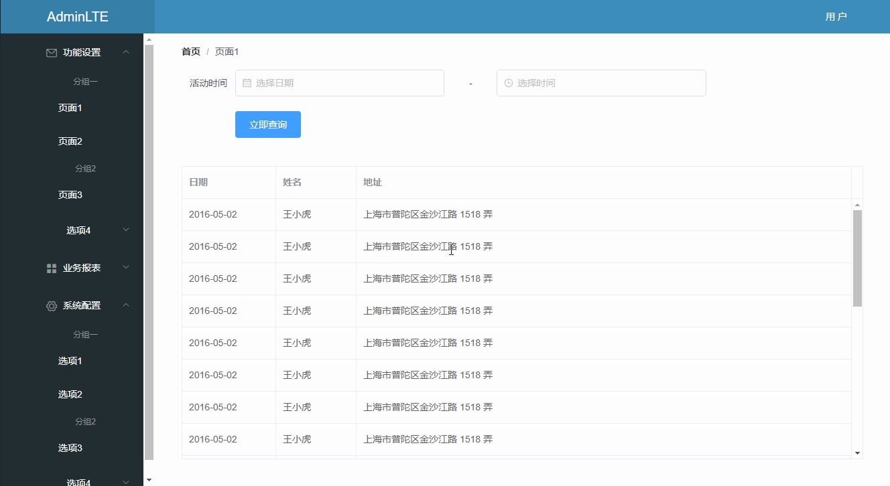

# vue-ts 基于vue和typescript编写的后台管理程序demo



## [在线体验](http://deltafx35c.com/)

## 实现功能

- 网站搭建 &radic;  
- 基本配置/目录结构 &radic;  
- UI库引入[element-ui] &radic;  
- http库引入[axios] &radic; 
- vuex使用[vuex-class] &radic; 
- 报表[echarts] &radic; 
- 分页 &radic; 
- 表单封装 &radic; 
- 文件导出 &times;  
- 富文本编辑器 &times;  
- 图片上传 &times;  
- 剪切板功能 &times;  


## Project setup
```
npm install
```

### Compiles and hot-reloads for development
```
npm run dev
```

### Compiles and minifies for production
```
npm run build
```

### Run your tests
```
npm run test
```

### Lints and fixes files
```
npm run lint
```

### Customize configuration
See [Configuration Reference](https://cli.vuejs.org/config/).
