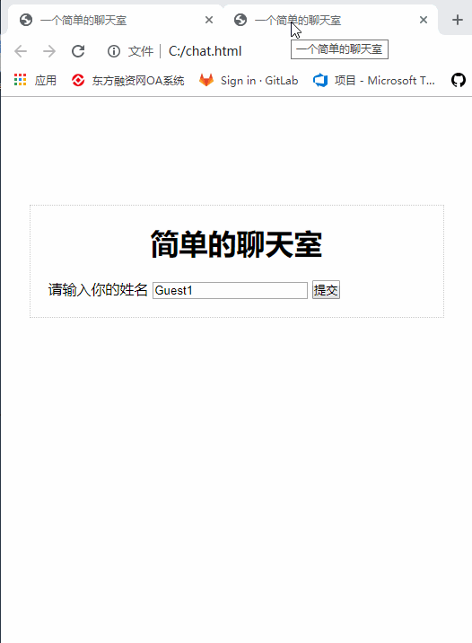

# 使用Express和Websocket搭建一个简单的聊天室

## Websocket简介

### [WebSocket 教程 By 阮一峰](http://www.ruanyifeng.com/blog/2017/05/websocket.html)

##  实现效果
  

##  使用Express搭建Websocket服务器

###  安装express和express-ws模块

```
  npm i express -S
  npm i express-ws -S
```

### 挂载express-ws中间件

```
const express = require('express')
const expressWs = require('express-ws')
const app = express()
expressWs(app)
app.listen('127.0.0.1', 3000)
```

### 使用router.ws定义websocket接口

```
const router = require('express').Router()
router.ws('/echo', function (ws, req) {
  ws.on('message', (msg) => {
    console.log(msg)
  })
}
```

### 消息收集及广播

```
const router = require('express').Router()
let wsSet = new Set() 
router.ws('/echo', function (ws, req) {
  wsSet.add(ws) // 收集来自不同客户端的websocket链接
  ws.on('message', (msg) => {
    console.log(msg)
  })
  ws.on('close', () => {
    wsSet.delete(ws)
  })
}
```

### 服务端发送心跳包维持链接

```
const router = require('express').Router()
router.ws('/echo', function (ws, req) {
  ws.on('pong', () => {
    ws.isAlive = true
    console.log(new Date() + ' pong')
  })
  const interval = setInterval(() => {
    if (ws.isAlive === false || ws.readyState !== 1) {
      console.log('websocket has been closed')
      clearInterval(interval)
      return ws.terminate()
    }
    ws.isAlive = false
    ws.ping()
  }, 2000)
}
```

## 修改Nginx配置支持反向代理Websocket请求
```
http {
  upstream api_server {
    server 127.0.0.1:3000;
  }
  map $http_upgrade $connection_upgrade {
    default upgrade;
    ''      close;
  }
  server {
    listen       80;
    listen       443 ssl;
    location /api/ {
      proxy_pass http://api_server;
      proxy_http_version 1.1;
      proxy_set_header Upgrade $http_upgrade;
      proxy_set_header Connection $connection_upgrade;
    }
  }
}
```

## 搭建简单的网页聊天室客户端

### 引用Vue.js

```
<script src="https://cdn.jsdelivr.net/npm/vue/dist/vue.js"></script>
```

### Vue Template
```
<div id="app">
  <h1>简单的聊天室</h1>
  <section v-show="!isLogin">
    <label>请输入你的姓名</label>
    <input type="text" v-model="myName" />
    <button class="submit" @click="submit">提交</button>
  </section>
  <ul class="contents" v-show="isLogin">
    <li v-for="(item,index) in contents" :key="index" :class="{right: item.name == myName}">
      <div v-if="item.name == myName">
        <span>{{item.message}}</span>
        <span class="name"> 我</span>
      </div>
      <div v-else>
        <span class="name">{{item.name}}</span>
        <span>{{item.message}}</span>
      </div>
    </li>
  </ul>
  <div class="send-box" v-show="isLogin">
    <input type="text" v-model="message" />
    <button class="send" @click="send">发送</button>
  </div>
</div>
```

### javascript

```
<script>
  var app = new Vue({
    el: '#app',
    data: {
      ws: null,
      myName: 'Guest',
      isLogin: false,
      senderName: 'Someone',
      message: 'Say Something',
      contents: []
    },
    methods: {
      submit() {
        this.ws = new WebSocket("ws://127.0.0.1:3000/api/echo")
        this.ws.onopen = (evt) => {
          this.ws.send(JSON.stringify({
            name: 'System',
            message: this.myName + ' has joined this room'
          }))
        }
        this.ws.onmessage = (evt) => {
          let msg = JSON.parse(JSON.stringify(evt.data))
          this.contents.push(JSON.parse(msg))
        }
        this.ws.onclose = (evt) => {
          this.ws.send(JSON.stringify({
            name: 'System',
            message: this.myName + ' has left this room'
          }))
        }
        this.isLogin = true
      },
      send() {
        this.ws.send(JSON.stringify({
          name: this.myName,
          message: this.message
        }))
      }
    }
  })
</script>
```

### css
```
<style>
  * {
    margin: 0;
    padding: 0
  }

  li {
    list-style: none
  }

  img {
    vertical-align: top;
    border: none
  }

  #app {
    width: 420px;
    margin: 120px auto;
    padding: 20px;
    border: 1px dotted #ccc;
  }

  h1 {
    text-align: center;
    margin-bottom: 20px;
  }

  .contents li {
    margin-bottom: 20px;
  }

  .right {
    text-align: right;
  }

  .name {
    color: rebeccapurple;
  }

  .right .name {
    color: red;
  }

  .send-box {
    margin-top: 20px;
  }
</style>
```
