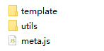
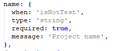
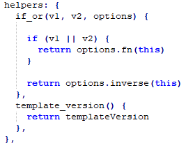

# 1.创建种子项目
  我们可以选择：
  ## fork一份官方种子项目，在此基础上进行修改
  [官方种子项目地址](https://github.com/vuejs-templates/webpack)
  
  或者
  ## 自定义新建一个种子项目

  ### 种子项目简单的目录结构示例
    

# 2.修改meta.js

  ## prompts

  - 作用：定义命令行窗口中的用户交互对话，以确定模板变量的值  
  - 参数：  
    * when:展示条件  
    * type：模板变量类型  
    * required：变量是否必须  
    * message：对用户展示的对话信息  
    * default：对话信息默认值  
    * choices：定义选择框内容  
  - 示例：  
      
  ## filters

  - 作用：根据模板变量的值决定项目初始化时拷贝哪些文件
  - 示例：  
      

  ## helpers

  - 作用：自定义模板函数
  - 示例：  
      

# 3.改造模板文件
  在项目源文件中嵌入模板变量和模板函数，使其成为模板文件  
    

# 4.部署与使用

  将种子项目上传至github  
  运行vue init username/repo my-project创建项目  
